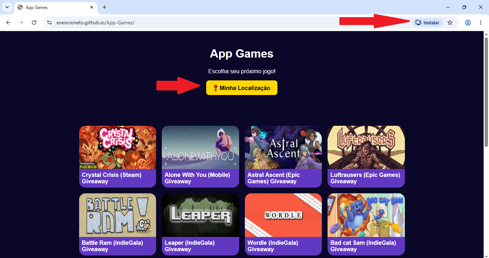

# App Games

Esse Site foi criado em Sala de Aula, para o aprendizado de utilização de APIs, pegamos uma lista jogos gratuitos usando a API do GamerPower.

## Essa é a Primeira Versão do Lighthouse(com o código que foi criado em sala):

### Versão 1 

## Essa é a Segunda Versão com o código alterado e com a separação do CSS e JavaScript:

### Versão 2 (HTML, CSS e JS separados)

## Versão após adicionar o  PWA e Gelocalização:

### Versão 3 (PWA e Geolocalização)

